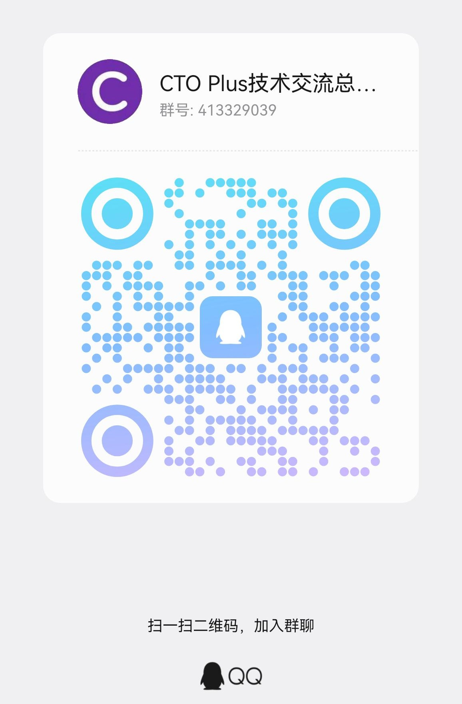
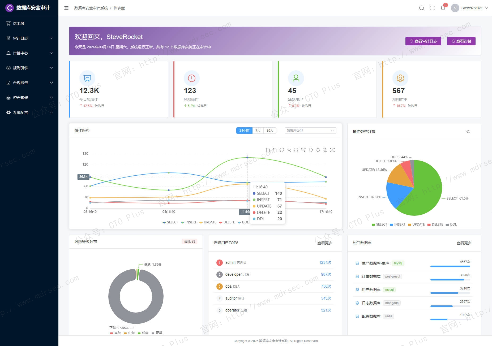
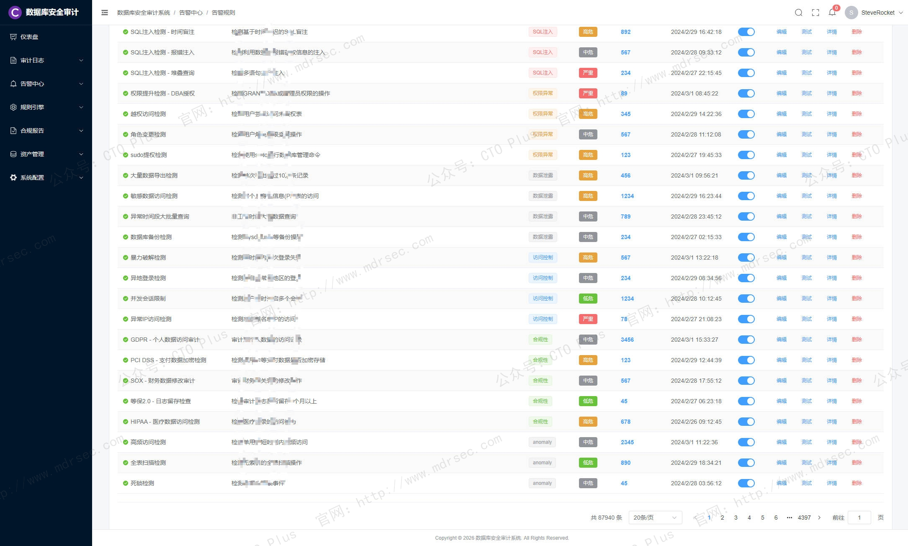
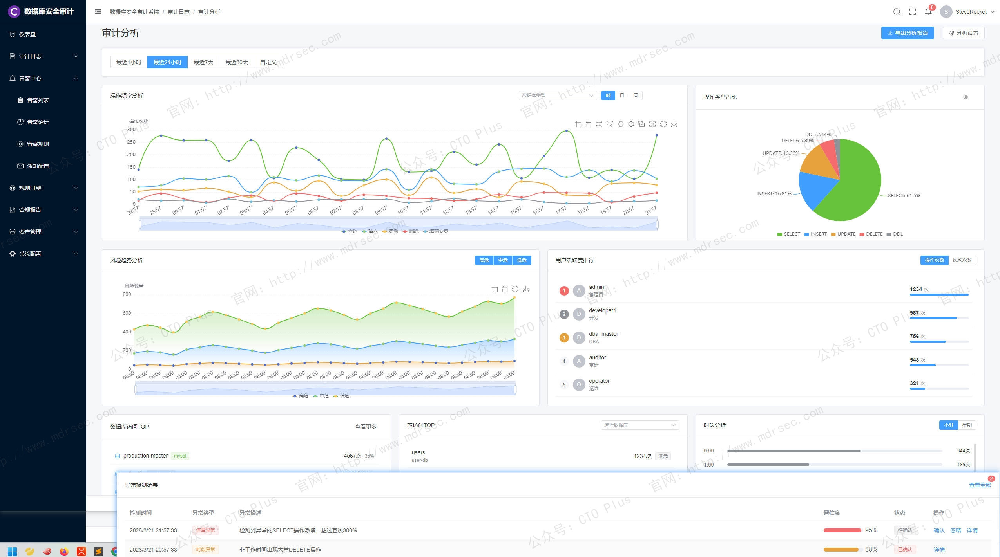

# 数据库安全审计系统（DSAS）

## 关于我们

- 官网： http://www.mdrsec.com

我们的技术文章和产品概述欢迎浏览我们的门户。

- 公众号：CTO Plus

最新的动态欢迎关注我们官方唯一公众号。

- 作者QQ

更详细更具体的需求，或者项目合作，或者问题 欢迎联系我。

- QQ群

我们官方组建的QQ群，如果您有兴趣也可以加入我们。

- 请喝咖啡

如果感兴趣，也可以请我喝杯咖啡

## 产品核心功能模块

## 一、数据库安全审计系统（DSAS）

数据库作为企业最核心的信息资产存储库，承载着客户资料、财务数据、商业机密等关键信息。然而，随着数据价值的不断提升，数据库面临的威胁也日益复杂——外部黑客利用Web应用漏洞发起SQL注入攻击，内部运维人员因权限过大可能进行违规操作甚至恶意篡改，数据泄露事件频发且后果愈发严重。

传统网络安全防护体系（如防火墙、IDS/IPS）主要聚焦于网络边界，对数据库层面的精细操作缺乏可见性。当攻击者绕过边界防护或内部人员利用合法权限进行越权操作时，传统手段往往束手无策。与此同时，《网络安全法》《数据安全法》《个人信息保护法》等法律法规的相继施行，以及等保2.0标准的全面落地，对数据库操作行为的审计与追溯提出了明确的合规要求。

我们自研了数据库安全审计系统（Database Security Audit System，简称DSAS）的专业安全产品。通过对数据库访问行为的全量采集、智能分析与实时告警，帮助企业实现“事前预警、事中阻断、事后追溯”的闭环安全管控，成为数据安全治理体系中不可或缺的一环。

这里我将为大家分享下我们数据库安全审计系统（Database Security Audit System，简称DSAS）的核心功能与关键特性，以下简称DSAS系统

系统部分功能包括如下：

- 核心审计：审计日志查询、SQL查询记录展示、过滤与搜索
    - 实时监控看板、数据访问量、风险操作统计
    - 告警中心、规则触发告警展示与处理
- 安全管理：策略规则管理、审计规则自定义与启用/禁用
    - 资产与权限管理、数据库资产、用户角色管理
- 合规报表：合规报告、等保/GDPR合规报告生成
    - 统计分析、多维数据可视化分析
- 系统管理：用户与审计、用户操作审计、系统日志

---

## 二、数据采集与协议解析能力

### 2.1 旁路部署与零侵入采集

我们DSAS系统的核心设计原则之一是“对业务零影响”。系统采用旁路部署模式，通过交换机端口镜像或网络分流器获取数据库访问流量，无需在数据库服务器上安装代理程序，不占用数据库主机资源，也不介入业务通信链路。这种部署方式具备以下优势：

- **快速上线**：无需重启数据库或修改应用配置，部署周期可缩短至小时级。
- **无单点风险**：审计设备故障不会阻断业务访问，网络层面自动旁路切换。
- **环境兼容性强**：同时支持物理服务器、虚拟机、云环境及容器化部署场景。

### 2.2 多协议

数据库通信协议种类繁多，我们DSAS系统具备丰富的协议解析能力。系统通过深度协议分析技术，对网络流量进行逐层解包，还原七层应用载荷，实现SQL语句的完整提取。

主流支持的数据库类型覆盖：

- **关系型数据库**：Oracle、Microsoft SQL Server、MySQL、PostgreSQL、DB2、Sybase、Informix等
- **国产数据库**：达梦、人大金仓、南大通用、神舟通用、瀚高、OceanBase、GaussDB等
- **大数据组件**：Hive、HBase、MongoDB、Elasticsearch、Redis等
- **数据仓库**：Teradata、Greenplum、ClickHouse等

### 2.3 超长语句与加密协议处理

实际业务场景中，应用程序可能产生超过64KB的超长SQL语句（如大批量INSERT、复杂存储过程调用）。我们DSAS系统支持跨包TCP流重组与SQL语句拼接，确保超长语句被完整捕获与解析，防止审计盲区 。

针对Microsoft SQL Server 2005及以上版本默认启用的加密身份认证流量，我们DSAS系统具备解密能力，破译TDS协议中的加密身份信息，确保登录用户身份准确识别 。

### 2.4 双向审计与绑定变量解析

具备完整的审计，覆盖“请求—响应”双向流量。我们DSAS系统不仅记录客户端发出的SQL请求，还捕获数据库服务器返回的执行结果、错误信息及受影响行数。对于使用绑定变量的SQL语句，系统自动关联变量值与SQL模板，还原完整语义。

---

## 三、日志存储与检索能力

### 3.1 海量日志高吞吐入库

大型企业数据库每日产生的审计日志可达数十亿条，我们DSAS系统具备高性能日志入库能力。产品实现每秒数万乃至数十万条SQL记录的入库速率，通过零拷贝技术、异步批量写入等手段降低I/O开销，确保审计数据实时持久化 。

### 3.2 高效存储与压缩

审计日志长期保存以满足合规要求，存储空间是核心成本因素。我们DSAS系统采用非结构化存储引擎与智能压缩算法，将单TB存储容量对应的日志条数提升至20亿级别以上。同时支持冷热数据分层存储策略，将超出活跃期的历史日志自动迁移至低成本存储介质。

### 3.3 秒级检索与多维查询

面对海量日志，检索效率直接影响溯源体验。我们DSAS系统提供秒级响应的全文检索能力，支持以下维度的组合查询：

- **时间维度**：精确到秒的时间范围筛选
- **身份维度**：数据库用户、操作系统用户、客户端IP、MAC地址、主机名
- **操作维度**：SQL操作类型（SELECT、INSERT、UPDATE、DELETE、DDL等）
- **对象维度**：数据库名、表名、字段名、存储过程名
- **风险维度**：告警等级、规则类型、攻击类别
- **内容维度**：SQL关键字、特定字段值、返回结果

### 3.4 日志防篡改与完整性保护

审计日志的法律效力依赖于其不可篡改性。我们DSAS系统对存储的日志数据进行数字签名或哈希校验，任何对日志文件的非授权修改都将被系统检测并告警。同时，日志导出时支持加密与签名，确保移交合规审计部门的数据具有法律效力。

---

## 四、审计策略与访问控制能力

### 4.1 细粒度审计策略配置

我们DSAS系统支持多层级的审计策略定义，使安全管理员能够按需聚焦关键操作，避免“全量审计”带来的存储与性能浪费。策略粒度应细化至：

- **主体维度**：指定数据库用户、IP地址段、客户端程序名、操作系统用户、登录时间窗口
- **客体维度**：指定数据库实例、Schema、表、视图、存储过程、字段
- **行为维度**：指定操作类型（SELECT、INSERT、DELETE、DDL、DCL等）、SQL执行时长阈值、返回行数阈值
- **风险维度**：指定风险等级、攻击类型、异常模式

策略组合支持“白名单+黑名单”模式，既可聚焦审计高风险操作，也可排除业务自动化任务的干扰 。

### 4.2 敏感数据发现与自动分类

我们DSAS系统具备数据发现功能，通过扫描数据库中的表结构及数据样本，自动识别身份证号、手机号、银行卡号、邮箱地址等敏感字段，并根据预置规则对数据资产进行分类分级。基于分类结果，系统可自动推荐审计策略模板，降低策略配置复杂度 。

### 4.3 精细化访问控制

同时，我们DSAS系统也可以集成数据库防火墙能力，可基于审计结果实现主动访问控制。其核心是基于“主体—客体—行为”三元组的动态授权模型：

- **主体控制**：可细化至用户、IP、客户端程序、时间频率
- **客体控制**：可精确至数据库、表、列、行级
- **行为控制**：覆盖SELECT、INSERT、UPDATE、DELETE及DDL操作

控制动作包括放行、告警、阻断、重写（脱敏）四种响应方式，实现从“只审不防”到“审防一体”的能力跃升 。

---

## 五、威胁检测与智能分析能力

### 5.1 SQL注入攻击检测

SQL注入仍是数据库面临的头号应用层威胁。我们DSAS系统内置丰富的SQL注入特征库，覆盖联合查询注入、报错注入、布尔盲注、时间盲注、堆叠查询注入、二次编码注入等主流攻击手法。检测引擎支持语义分析与语法树比对，不仅匹配已知攻击模式，还能识别变形注入和0day利用尝试 。

### 5.2 高危操作实时告警

系统预置针对高风险操作的检测规则，包括但不限于：

- **权限变更**：GRANT、REVOKE、CREATE USER、ALTER USER等操作
- **结构变更**：DROP TABLE、TRUNCATE、ALTER TABLE DROP COLUMN等不可逆操作
- **数据批量篡改**：无WHERE条件的UPDATE/DELETE、批量INSERT异常
- **数据拖库检测**：短时间内大量SELECT操作、全表导出行为
- **特权操作**：sys/system/sa等高权限账户的敏感操作

告警触发后，系统支持邮件、短信、SNMP Trap、Syslog、企业微信/钉钉/飞书等多种通知渠道，并可设置基于时间段的告警静默策略 。

### 5.3 基线偏离检测

我们DSAS系统建立数据库运行基线模型，通过学习历史访问模式，自动识别偏离正常基线的异常行为。典型检测场景包括：

- **访问频率突变**：某账户在非工作时间产生大量查询
- **来源IP异常**：从未出现过的IP地址访问核心数据库
- **操作模式变更**：历史只执行SELECT的账户突然执行DDL
- **返回数据量异常**：单次查询返回行数显著超出历史均值

### 5.4 账号状态监控与弱口令检测

系统持续监控数据库账号状态，检测弱口令、空口令、默认口令等配置缺陷。对于长时间未活跃的“僵尸账号”、权限过大的“特权账号”，应生成专项治理报告。产品还支持与AD/LDAP集成，实现账号生命周期管理的统一审计 。

---

## 六、三层关联审计与应用用户追溯

### 6.1 三层架构的审计困境

现代企业应用普遍采用“客户端—应用服务器—数据库”三层架构。传统数据库审计只能捕获应用服务器连接池的通用账号，无法追溯到发起请求的真实终端用户，导致审计日志的问责价值大打折扣。

### 6.2 三层关联技术原理

DSAS通过以下技术路径实现应用用户关联：

- **HTTP协议解析**：从Web流量中提取URL、Cookie、SessionID、请求参数等应用层要素
- **SQL关联映射**：将应用层要素与数据库SQL操作按时间窗口和事务上下文进行关联匹配
- **用户信息提取**：从HTTP请求头、JWT Token、自定义Header中解析真实用户身份

关联后的审计记录同时包含前端用户ID、浏览器指纹、应用服务器IP、数据库SQL语句，形成完整的访问链路 。

### 6.3 应用审计的价值延伸

实现三层关联后，DSAS不仅可用于安全追溯，还可服务于业务审计场景：

- 定位数据泄露源头：某条敏感数据被泄露后，追溯最近访问该数据的所有应用用户
- 业务操作审计：记录客服人员查询客户信息的明细，防范内鬼数据窃取
- 合规报表输出：按业务用户维度生成数据访问合规报告

---

## 七、报表生成与合规支持能力

### 7.1 预置合规报表模板

我们DSAS系统内置面向主流合规标准的报表模板，支持一键生成符合要求的审计报告：

- **等保2.0**：覆盖安全计算环境—数据库审计相关控制点
- **SOX法案**：聚焦财务报表相关IT控制（ITGC）
- **HIPAA**：医疗隐私数据访问审计
- **PCI-DSS**：支付卡数据安全标准审计
- **GDPR/个人信息保护法**：个人数据访问与处理记录

### 7.2 自定义报表引擎

除预置模板外，系统提供可视化的报表设计器，允许用户自定义报表维度、指标、展示图表及输出格式。典型报表类型包括：

- **会话分析报表**：数据库会话时长、来源分布、并发趋势
- **风险统计报表**：告警数量趋势、风险类型分布、高风险用户TOP10
- **访问行为报表**：操作类型占比、高频访问对象排行、失败登录统计
- **性能分析报表**：慢SQL排行、执行耗时分布、资源消耗TOP10

报表输出支持PDF、HTML、Excel等格式，并可配置周期性自动生成与邮件分发。

---

## 八、系统自身安全与高可用保障

### 8.1 三权分立管理模型

DSAS自身的管理体系遵循三权分立原则，设置相互制约的管理员角色 ：

- **系统管理员**：负责系统配置、网络设置、存储管理、服务启停等运维操作
- **安全管理员**：负责审计策略配置、规则库更新、告警阈值设定等安全决策
- **审计管理员**：负责日志查询、报表生成、取证分析等审计职能

任何单一管理员均无法关闭审计功能或删除审计日志，有效防范内部人员恶意操作。

### 8.2 日志模糊化与隐私保护

审计日志本身可能包含敏感数据（如登录密码、个人信息）。我们DSAS系统支持日志模糊化处理，对指定字段（如密码参数、身份证号、手机号）进行脱敏替换，确保审计数据的使用不会产生二次泄露风险 。

### 8.3 高可用部署架构

在关键业务场景下，我们DSAS系统本身需具备高可用能力：

- **双机热备**：主备节点通过心跳检测实现故障自动切换，切换时间≤30秒
- **Bypass机制**：串联部署模式下，设备故障自动切换为物理导通，保障业务不中断
- **负载均衡**：多台审计设备组成集群，统一管理、分散采集

### 8.4 资源监控与自保护

系统持续监控自身运行状态，包括CPU利用率、内存占用、磁盘空间、网络吞吐等指标。当磁盘空间触及告警阈值时，自动触发日志归档或按策略清理，防止因存储耗尽导致审计中断。

---

## 九、性能指标与扩展能力

### 9.1 关键性能指标参考

DSAS的核心性能指标直接影响其适用场景：

| 指标项      | 入门级       | 企业级        | 大型/超大型      |
|----------|-----------|------------|-------------|
| SQL处理能力  | ≥5,000条/秒 | ≥30,000条/秒 | ≥100,000条/秒 |
| 日志存储密度   | ≥10亿条/TB  | ≥20亿条/TB   | ≥30亿条/TB    |
| 检索响应时间   | ≤10秒      | ≤3秒        | ≤1秒         |
| 网络延迟（串联） | ≤1ms      | ≤500μs     | ≤200μs      |

### 9.2 横向扩展能力

随着业务规模增长，我们DSAS系统支持灵活的扩展方式：

- **分布式采集节点**：在网络分中心部署采集探针，日志统一汇聚至集中管理平台
- **分级部署架构**：总部—分支机构两级部署，分支本地审计+总部统一管控
- **云原生适配**：支持Kubernetes环境部署，实现采集组件的弹性伸缩

### 9.3 API与第三方集成

我们DSAS系统提供完善的北向接口，支持与安全运营中心（SOC）、安全信息与事件管理（SIEM）、运维审计堡垒机等第三方系统集成。典型集成方式包括：

- **Syslog转发**：实时将告警事件以标准Syslog格式发送至日志中心
- **RESTful API**：提供日志查询、策略配置、报表生成的程序化接口
- **SNMP Trap**：重大告警通过SNMP协议上报网管平台

---

## 最后

### 核心能力总结

我们自研的企业级数据库安全审计系统具备以下六大核心能力：

1. **全量采集与精准解析**：覆盖主流数据库类型，支持超长语句、加密协议、绑定变量的完整解析
2. **高效存储与快速检索**：海量日志高吞吐入库，秒级检索响应，满足实时溯源需求
3. **智能检测与实时告警**：内置丰富的威胁特征库，结合基线学习识别异常行为
4. **三层关联与用户追溯**：穿透应用服务器，将数据库操作定位至真实业务用户
5. **合规报表与审计支撑**：预置等保、GDPR等标准报表模板，满足监管检查要求
6. **自身安全与高可用**：三权分立管理、日志防篡改、双机热备等安全保障机制
- **协议支持广度**：覆盖企业现有的数据库类型及未来3-5年的技术栈规划
- **性能容量匹配**：审计设备的处理能力需匹配数据库峰值SQL吞吐量的1.5倍以上
- **部署模式灵活性**：同时支持旁路镜像、探针采集、代理网关等多种部署形态
- **国产化适配程度**：在信创环境下，对国产数据库、国产CPU、国产操作系统的兼容性
- **运维成本评估**：策略调优难度、告警误报率、日志存储扩容频率等长期运维因素

### 部署策略建议

- **核心交易系统**：建议采用物理设备独立部署，启用全部审计策略，日志保存不少于6个月
- **一般业务系统**：可采用虚拟化形态或云原生SaaS服务，按需配置审计范围
- **开发测试环境**：建议启用审计但降低日志留存周期，重点监控数据导出与权限变更操作
- **混合云场景**：优先选择支持统一管理平台的产品，实现多云环境审计策略的统一编排

数据库安全审计不仅是合规的“必答题”，更是构建纵深防御体系的关键一环。唯有选择功能完备、性能强劲、扩展灵活的DSAS产品，才能真正实现“数据在哪里，审计就延伸到哪里”的安全愿景。

## 产品清单

### 企业网络安全运营中心产品

- 资产安全配置管理系统（SCMDB）
- 终端侦测与响应系统（EDR）
- 网络侦测与响应系统（NDR）
- 企业网络资产攻击面管理系统（CAASM）
- 资产暴露面管理系统（AEMS）
- 网络安全蜜罐管理系统（HoneyPot）
- 安全事件收集与告警管理系统（SIEM）
- 扩展侦测与响应系统（XDR）
- 多引擎脆弱性扫描系统（VAS）
- 多源日志审计监测系统（LAS）
- 网络安全威胁情报中心（TIS）
- 网络安全漏洞库管理系统（VDBS）
- 网络安全编排与自动化响应（SOAR）
- 威胁狩猎系统（THS）
- 数据库安全审计系统（DSAS）
- AI智能体安全态势管理系统（AISPM）
- Web防火墙（WAF）
- 网站安全监测平台（WSM）
- 网络安全态势感知平台（SSAP）
- 网络安全自动化应急响应工具系统（NSRT）
- 企业网络安全运维工具系统（SecTools）
- 网络安全自动化等保测评系统（ASES）
- 浏览器安全监测防护系统（BSMPS）
- 网络安全用户实体行为分析系统（UEBA）
- 互联网电信诈骗预警防护系统（TPFWS）
- 云原生安全管理平台（CNAPP）
- 自动化渗透测试系统（PTS）
- 工业企业信息安全监测中心（IoT SOC）
- 企业智能安全运营中心（AISOC）

### 企业自动化运维产品

- 运维智能监控告警管理平台（AIMAMS）
- 企业网络工具系统（NTools）
- 自动化测试系统（AutoTest）
- 自动化运维系统（AutoOps）
- 企业运维工具系统（OpsTools）
- 物联网管理系统（IoTS）
- 软件开发生命周期管理系统（SDLC）
- IT流程管理系统（ITSM）

### 企业数字化运营资源管理系统产品

- 制造执行管理系统（MES）
- 运输管理系统（TMS）
- 跨境电商企业资源管理系统（ERP）
- 企业客户关系管理系统（CRM）
- 跨境电商仓库管理系统（WMS）
- 财务管理系统（FMS）
- 质量管理系统（QMS）
- 精准营销管理系统（PMS）
- 智能生产管理系统（SPMS）
- 电商BI系统（BI）
- 智能互联网分布式爬虫系统（AISpider）
